# 🚀 Projeto 6 - COBOL + MySQL + ODBC

## 📋 Descrição

Projeto desenvolvido em COBOL com integração a banco de dados MySQL, utilizando arquivos TXT para processamento de dados e scripts Python para testes de conectividade.

O objetivo é simular um ambiente corporativo de processamento de clientes e transações bancárias, demonstrando conceitos de:

- Processamento Batch
- Manipulação de Arquivos
- Banco de Dados Relacional
- Integração ODBC
- JCL (Job Control Language)
- Organização de Projetos Mainframe

---

# 👨‍💻 Autor

**Andrey Dias Ferreira**

Projeto desenvolvido para fins acadêmicos e preparação para oportunidades de estágio em ambiente Mainframe.

---

# 🛠 Tecnologias Utilizadas

- COBOL
- MySQL
- Python
- ODBC
- JCL
- Git
- GitHub
- VS Code
- MySQL Workbench

---

# 📁 Estrutura do Projeto

```text
PROJETO6-COBOL-ODBC
│
├── COBOL
│   ├── PROJ6CLI.cbl
│   ├── PROJ6MOV.cbl
│   ├── PROJ6SQL.cbl
│
├── DADOS
│   ├── CLIENTES.TXT
│   ├── TRANSACOES.TXT
│   ├── SAIDA.TXT
│   └── ERROS.TXT
│
├── SQL
│   ├── banco.sql
│   ├── integrador_odbc.py
│   └── teste_odbc.py
│
├── JCL
│   └── PROJ6.jcl
│
├── PRINTS
│
└── README.md
```

---

# 🔄 Fluxo do Projeto

```text
CLIENTES.TXT
      │
      ▼
 PROJ6CLI
      │
      ▼
Exibição dos Clientes

TRANSACOES.TXT
      │
      ▼
 PROJ6MOV
      │
      ├──► SAIDA.TXT
      │
      └──► ERROS.TXT

MySQL
      ▲
      │
 integrador_odbc.py
      │
      ▼
 teste_odbc.py
```

---

# 📂 Programas COBOL

## PROJ6CLI

Responsável por:

- Ler CLIENTES.TXT
- Exibir clientes cadastrados
- Contabilizar registros processados

---

## PROJ6MOV

Responsável por:

- Ler TRANSACOES.TXT
- Processar créditos e débitos
- Gerar SAIDA.TXT
- Registrar inconsistências em ERROS.TXT

---

## PROJ6SQL

Programa de estudo para integração entre COBOL e banco de dados via ODBC.

---

# 🗄 Banco de Dados

Banco:

```sql
projeto_cobol
```

Tabelas:

```sql
CLIENTES
TRANSACOES
ERROS_PROCESSAMENTO
```

---

# 🐍 Scripts Python

## integrador_odbc.py

Realiza integração com MySQL utilizando ODBC.

---

## teste_odbc.py

Executa testes de conectividade e consultas ao banco.

---

# 📸 Evidências de Execução

## Estrutura do Projeto

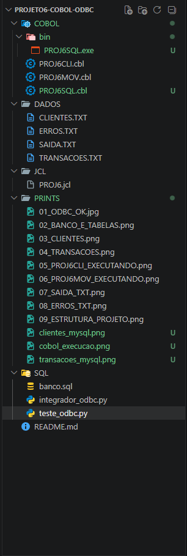

---

## Banco de Dados - Clientes

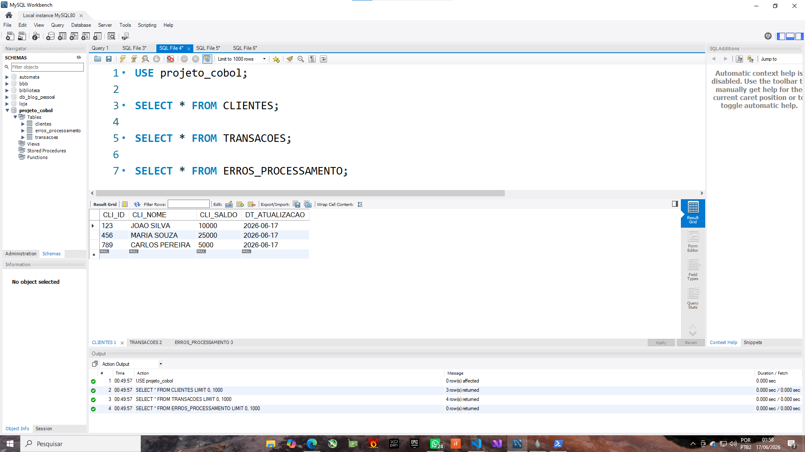

---

## Banco de Dados - Transações

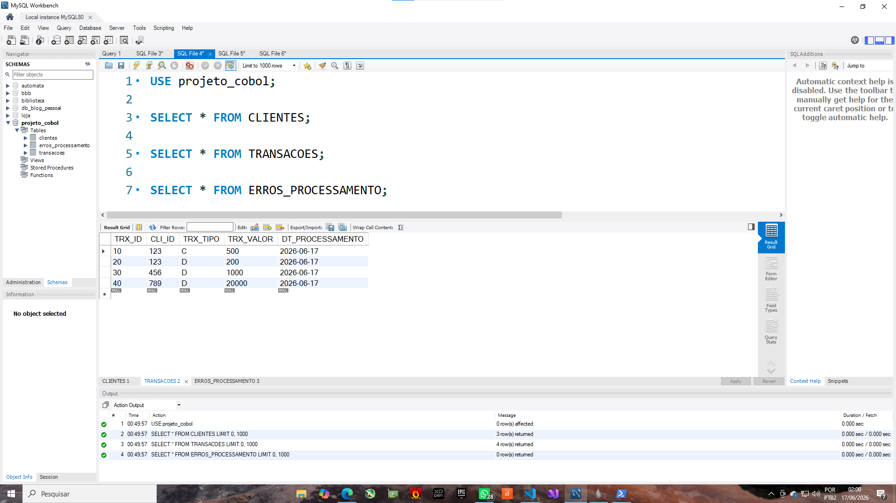

---

## Execução COBOL


---

## Configuração ODBC

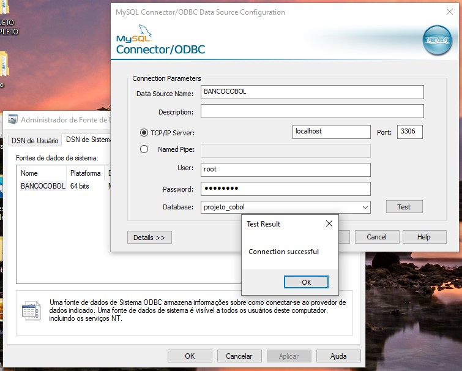

---

## Banco e Tabelas

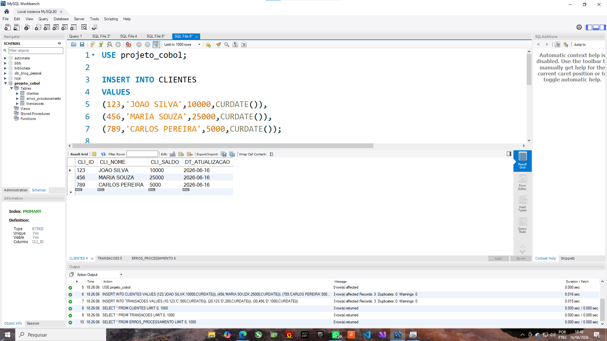

---

## Tabela CLIENTES

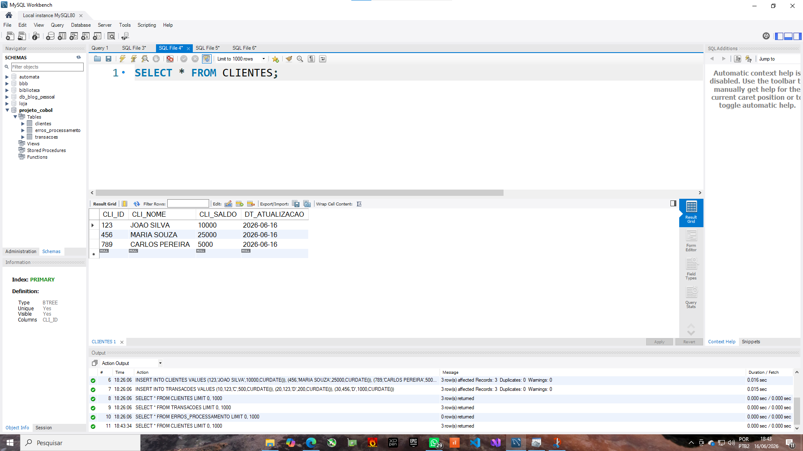

---

## Tabela TRANSACOES

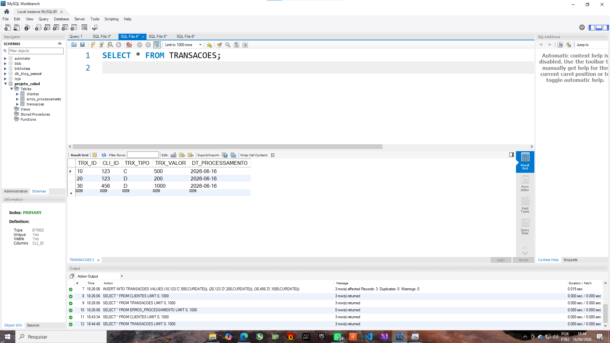

---

## Programa PROJ6CLI

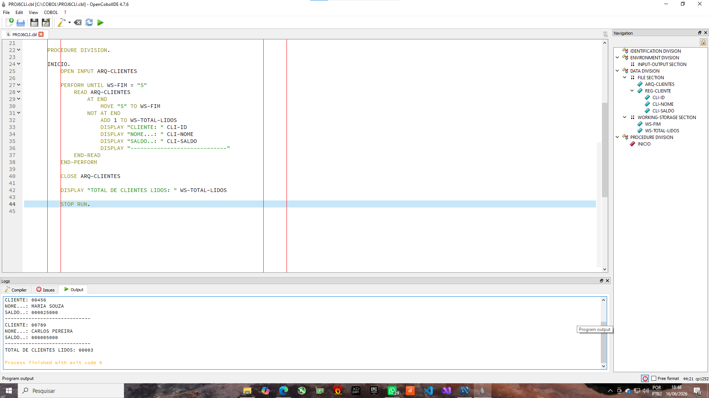

---

## Programa PROJ6MOV

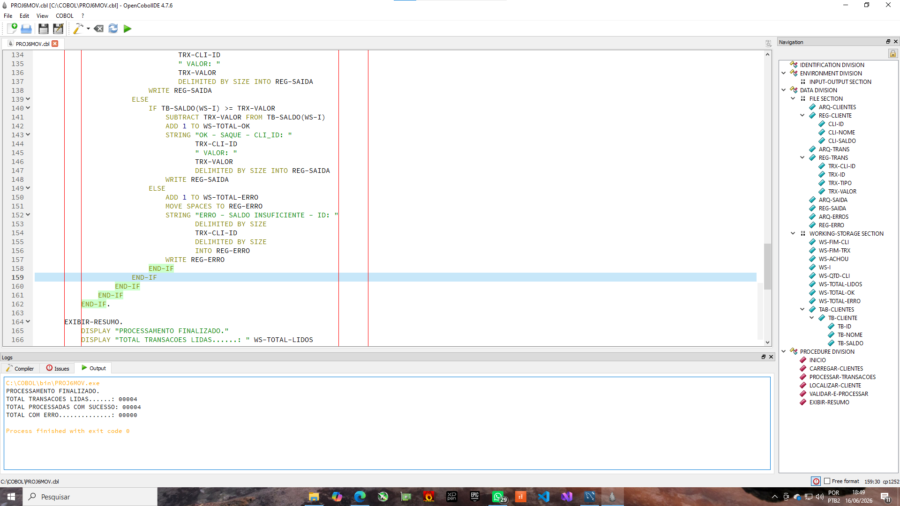

---

## Arquivo SAIDA.TXT

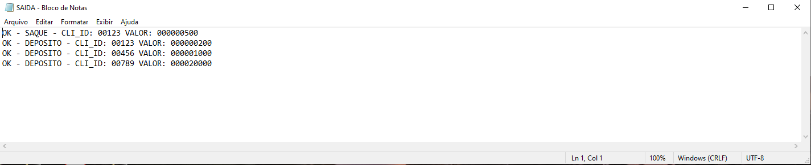

---

## Arquivo ERROS.TXT

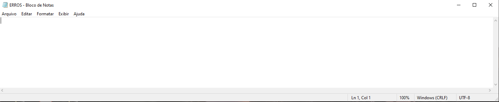

---

## Estrutura Final do Projeto

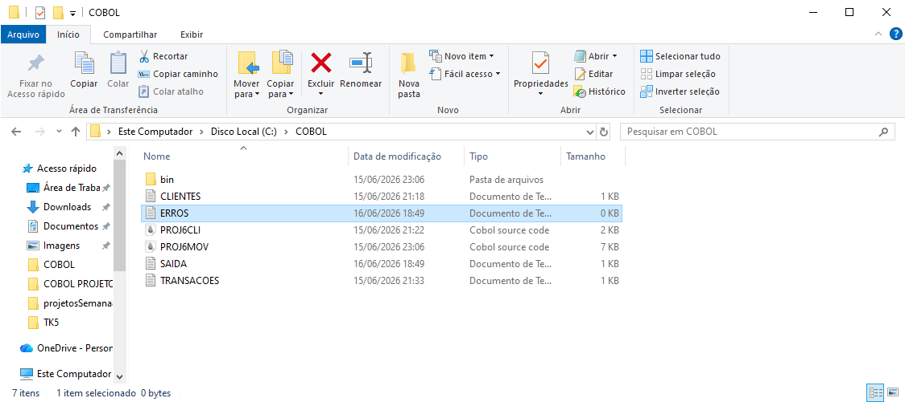

---

# ✅ Status Final

| Item | Status |
|--------|--------|
| COBOL | ✅ |
| Processamento de Arquivos | ✅ |
| MySQL | ✅ |
| ODBC | ✅ |
| Python | ✅ |
| JCL | ✅ |
| GitHub | ✅ |
| Documentação | ✅ |
| Evidências | ✅ |

---

# 🎯 Conclusão

O projeto permitiu aplicar conceitos de desenvolvimento COBOL, manipulação de arquivos, integração com banco de dados e organização de projetos em ambiente semelhante ao utilizado em sistemas corporativos e Mainframe.

Representa uma simulação prática de processamento de clientes e transações bancárias, demonstrando conhecimentos em COBOL, SQL, Python, GitHub e documentação técnica.